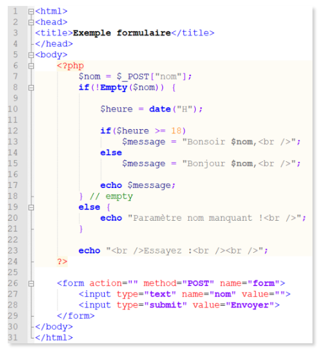

# Cours SIN : php/mysql

## TD1 - Création de BD et exploitation PHP
Soit la la base de données avec une table décrivant une famille :


La formulation de l'ordre de création de la table (image ci-dessus) :
```lanagage sql:
create table famille_tbl (id int(11) NOT NULL auto_increment, nom varchar(255) NOT NULL, prenom varchar(255) NOT NULL, statut varchar(255) NOT NULL, date date DEFAULT '1970-01-01' NOT NULL, PRIMARY KEY (id));
```

Requêtes pour initialiser votre table "famille_tbl":

INSERT INTO famille_tbl VALUES( '', 'Dupond', 'Grégoire', 'Grand-père', '1932-05-17');

INSERT INTO famille_tbl VALUES( '', 'Dupond', 'Germaine', 'Grand-mère', '1939-02-15');

INSERT INTO famille_tbl VALUES( '', 'Dupond', 'Gérard', 'Père', '1959-12-22');

INSERT INTO famille_tbl VALUES( '', 'Dupond', 'Marie', 'Mère', '1961-03-02');

INSERT INTO famille_tbl VALUES( '', 'Dupond', 'Julien', 'Fils', '1985-05-17');

INSERT INTO famille_tbl VALUES( '', 'Dupond', 'Manon', 'Fille', '1990-11-29');

#### 1.1- Affichage des résultats tels qu'ils sont dans la table sans condition.
  Le programme doit donner le résultat suivant :

« Dupond Grégoire (Grand-père), date de naissance : 1932-05-17 »

« Dupond Germaine (Grand-mère), date de naissance : 1939-02-15 »

« Dupond Gérard (Père), date de naissance : 1959-12-22 »

« Dupond Marie (Mère), date de naissance : 1961-03-02 »

« Dupond Julien (Fils), date de naissance : 1985-05-17 »

« Dupond Manon (Fille), date de naissance : 1990-11-29 »

#### 1.2- Affichage des résultats par ordre alphabétique de prénom.
« L'opérateur ORDER BY permet de classer soit alphabétiquement soit numériquement suivant le type du champ. »

« Si l'on souhaite classer en décroissant (ex. de Z à A), nous  y ajouterons DESC soit : ORDER BY prenom DESC »

Résultat attendu :

« Dupond Gérard (Père), date de naissance : 1959-12-22 »

« Dupond Germaine (Grand-mère), date de naissance : 1939-02-15 »

« Dupond Grégoire (Grand-père), date de naissance : 1932-05-17 »

« Dupond Julien (Fils), date de naissance : 1985-05-17 »

« Dupond Manon (Fille), date de naissance : 1990-11-29 »

« Dupond Marie (Mère), date de naissance : 1961-03-02 »

#### 1.3-Affichage des résultats par comparaison de date.
L'avantage d'avoir un type DATE dans notre base de données, c'est que nous pouvons comparer des dates dans la requête SQL.

Ici nous ne souhaitons afficher que les membres de la famille qui sont nés avant le 1er janvier 1960, soit : WHERE date<'1960-01-01'
<pre>SELECT * FROM `famille_tbl` WHERE date<'1960-01-01' </pre>


## TD2 - Site dynamique de gestion de famille
Reprenez la base de données du TD1 et écrire une application permettant :

- d'ajouter un enregistrement (nom, prénom, ...) (formulaire)

- de consulter toute la table

- (optionnel) de consulter par un critère choisi dans une liste (formulaire)



Le TD2 est découpé en 4 étape : [étape 1](https://github.com/sinbrive/php-mysql-TD-eleves/tree/master/TD2/etape1), [étape 2](https://github.com/sinbrive/php-mysql-TD-eleves/tree/master/TD2/etape2), [étape 3](https://github.com/sinbrive/php-mysql-TD-eleves/tree/master/TD2/etape3), [étape 4](https://github.com/sinbrive/php-mysql-TD-eleves/tree/master/TD2/etape4). A chaque fois, un fichier index.php incomplet est donné. Votre travail est de le compléter et le tester. Le résultat final attendu correspond à l'étape 4.

l'ordre d'insertion avec les variables PHP :
```language : php
    $sql = "INSERT INTO famille_tbl (nom, prenom, statut, date) VALUES ('$nom', '$prenom', '$statut', '$date')";
    $result = $conn->query($sql);
```


## TD 3 : portage de la version Réseau IP Javascript 

En apprenant les bases du langage Javascript, vous avez réalisé une application permettant de décrire les éléments d'un réseau IP à partir de l'adresse d'un hôte.

On vous demande ici de réaliser une autre application à base de PHP/MySQL ayant pour fonction :

**Gestion d'un parc informatique (on se limite aux terminaux PC).**

Travail à faire :
- TD3a : Récrire (on dit porter) le site Javascript calculant les adresses IP, en PHP  
   - [partez du dépot: **corrige-ipcalc-js**](https://github.com/sinbrive/corrige-ipcalc-js)
   - Aides :
     - la fonction split en PHP : [explode()](https://www.w3schools.com/php/func_string_explode.asp)
     - la fonction random en PHP : [rand()](https://www.w3schools.com/php/func_math_rand.asp)
     - Conversion string en entier : (int)$nom_string;
     - inclure un fichier php : include "nom_fichier.php";
     - portée des variables : [ce lien parmi d'autres](https://www.pierre-giraud.com/php-mysql-apprendre-coder-cours/portee-variable-fonction)
     - Insérer une variable php dans html :  ``` <?php echo $nom_variable; ?> ``` 
- TD3b : Ecrire un site qui permet de gérer le parc informatique (uniquement les PC) du lycée Réaumur
   - Pour chaque PC : Référence, Numéro de salle, Adresse MAC, IP/masque, l'adresse réseau, l'adresse de diffusion
   - consultation (par critères divers) : pour chaque PC afficher les caractéristiques du réseau correspondant
   - ajout d'un PC
   - suppression d'un PC
   - mise à jour d'un PC
   - vérifier si des PC sélectionnés peuvent communiquer
   - Eléments du travail attendu (les calculs réseaux n'y sont pas encore inclus):
   - 
### Attention :
Toutes vos productions doivent être rendues sur eLyco.
